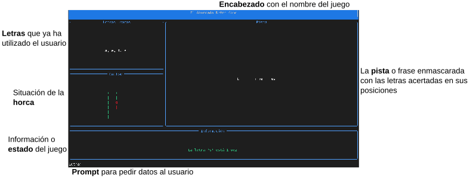

# Antes de empezar, hay algunos requirimientos
Se **rechazarán las prácticas** que:

- **No cumplan con las PEP-8**, con dos excepciones: las líneas pueden ser de hasta 100 caracteres y no hace falta añadir docstrings en las funciones y los módulos.
- Los comentarios y los nombres de variables y funciones tienen que ser en **inglés**.
- Los **nombres de variables y funciones tienen que ser descriptivos**. Se pueden usar las letras `i`, `j`... para nombres de variables que contienen índices y contadores en bucles.

Las prácticas rechazadas podrán ser corregidas y vueltas a entregar, pero cada **entrega extra supondrá una penalizacion del 20%**.

Voy a leer todo el código que escribas: sé consciente de ello :sunglasses:.

# Hangman
En esta práctica tienes que desarrollar el juego del Ahorcado (Hangman en inglés) usando el módulo `src.view.gallow` para la parte "gráfica". Se trata de un juego hecho para la terminal con una biblioteca de Python llamada Rich.

## ¿Cómo debe funcionar el juego?
El juego es un Ahorcado en solitario. Solo un jugador intentando adivinar frases con sus 6 oportunidades:

1. Lo primero que tiene que hacer tu programa es cargar una frase de forma aleatoria en el fichero `assets/sentences.txt`
   - Esta es la frase que el usuario tiene que adivinar
2. Al comenzar el juego aparece la horca vacía, la frase enmascarada y el prompt esperando una letra
   - El programa tiene que asegurarse que el usuario escribe una letra y solo una letra
   - En este juego las vocales se consideran iguales aunque tengan acentos, diéresis... Es decir, en este juego la letra "a" es igual que la letra "ä"
   - No distingue minúsculas y mayúsculas aunque en la frase enmascarada tiene que aparecer la letra acertada como esté en la frase original
3. Cada letra introducida por el usuario aparecerá en la parte correspondiente para que el usuario sepa las letras que ha utilizado
4. La pista con la frase enmascarada hay que actualizarla cada vez que el usuario acierte una letra y recuerda que tiene que aparecer la letra como en la frase original
5. Cuando se falla una letra se indica en el panel de información y se cambia la horca
6. Cuando se acierta una letra se indica en el panel de información cuántas veces está la letra y se actualiza la pista
   - Además, se preguntará al usuario si se sabe la frase para intentar adivinarla
   - Si quiere adivinarla y falla entonces se suma un intento y se actualiza la horca además de indicarlo en el panel de información
   - Si quiere adivinarla y, efectivamente, la adivina entonces se acaba el juego indicando al usuario que ha ganado
7. El juego acaba si:
   - No quedan más letras que desenmascarar: gana el usaurio
   - No lo quedan más intentos: pierde el usuario
   - Como se indicó arriba, el usuario pide adivinar la frase y lo hace: gana el usuario

# Entorno virtual
Antes de empezar necesitas poner en marcha un "Virtual Environment" de Python e instalar las dependencias. ¿Cómo? Te lo explico a continuación:

1. Entra al proyecto, carpeta "hangman"
2. Ahí dentro ejecuta la siguiente orden de Python para crear un "Virtual Environment": `python -m venv venv`
3. Ese comando creará una carpeta llamada `venv`
4. Ahora, puedes "entrar" al entorno virtual ejecutando esta orden: `source venv/bin/activate`
5. En el prompt ahora ves que pone `(venv)` al principio lo que significa que estás dentro del entorno virtual
6. Instala las dependencias con el comando: `pip install -r requirements.txt`

Ya está, ya puedes dar comienzo a la práctica.

# Ejecutar el programa
Para ejecutar el programa, desde la carpeta `hangman` usa el intérprete de Python tal que así: `python -m src.main`.

# Lanza los tests
Para ejecutar los tests, puedes hacerlo desde VSCode o desde la terminal con el comando `pytest`. Dicho comando lo tienes que lanzar desde la carpeta `hangman`.

# El módulo src.view.gallow
Para "dibujar" en pantalla tienes que usar este módulo. La UI del juego consta de 5 partes que se describen en la siguiente imagen:

En los siguientes apartados te explico cómo usar este módulo para dibujar lo que necesites.

## Mostrar información
Para mostrar mensajes para informar al usuario de lo que quieras usa la función `ui_show_info`.

## Mostrar la pista (frase enmascarada con letras acertadas)
Usa la función `ui_hint`.

## Dibujar la horca
Usa la función `ui_gallow` a la que, tan solo, tienes que indicar el número de intentos gastados por el usuario.

## Mostrar las letras usadas
Usa la función `ui_letters` indicando, en una lista, los caracteres ya utilizados.

## Preguntar lo que quieras al usuario
Usa la funcion `ui_ask`, pásale la pregunta y obtendrás la respuesta.

## Mostrar resultado del juego al usuario
Tienes tres funciones:

- `ui_game_over` para indicar al usuario que se ha terminado el juego y ha perdido
- `ui_win` para indicar al usuario que se ha terminado el juego y ha ganado
- `ui_error` si se produce algún error crítico en el programa y tienes que terminar repentinamente

