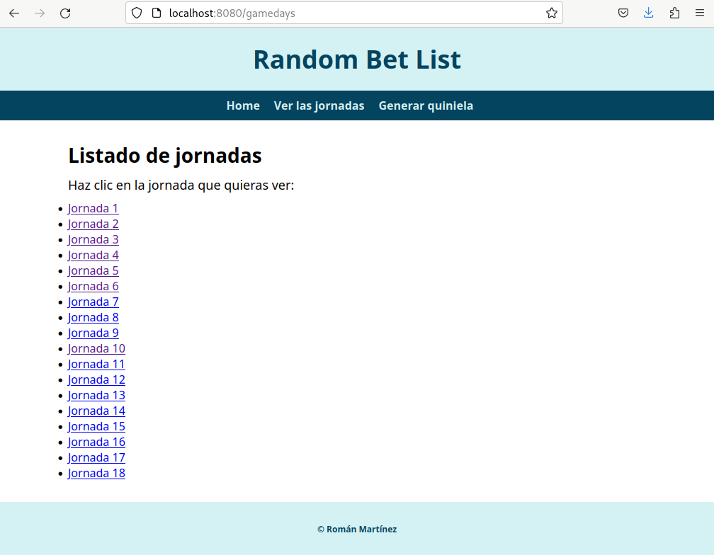
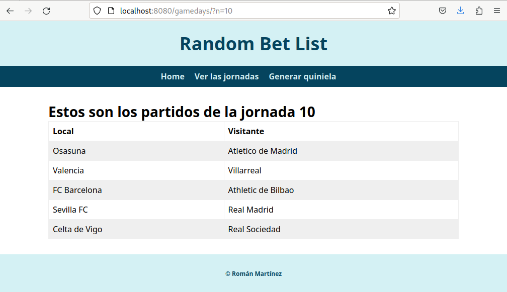

# Antes de comenzar
Estos son los requisitos generales que debes cumplir:

- Usar las PEP-8 cuando escribas tu código en Python.
- Los ficheros HTML no se modificarán, a menos que se diga lo contrario.
- Si en el enunciado se indica, explícitamente, que se modifique un HTML, se hará siguiendo escrupulosamente este enunciado.
- No dejes `print`s en tu código y asegúrate que, antes de entregar, eliminas todo código que uses a modo de depuración y prueba.
- Todo código sospechoso de haber sido copiado/pegado, "chagpteado", etc, llevará al alumnado al procedimiento de "prueba de autenticidad".

Esta práctica la vas a desarrollar por hitos. Cada hito logrado supondrá una nota máxima que se indicará en este enunciado. Se corregirá hasta el hito al que hayas llegado. Además, indicaré cuántas horas asignadas a clase tiene caca hito.

# Descripción de la práctica en general
En esta práctica desarrollarás una aplicación web con Python, siguiendo la especificación WSGI como hemos estado estudiando en clase estas últimas semanas.

Esta aplicación tiene una serie de páginas que generará el programa Python a desarrollar en la que todo gira en torno a la elaboración de quinielas aleatorias de una competición de fútbol ficticia en la que participan 10 equipos.

# Descripción del proyecto a completar que te proporciono
Para el desarrollo de esta práctica te proporciono el siguiente proyecto a completar:

``` shell
random_bet_list
├── README.md
├── requirements.txt
├── requirements_windows.txt
├── src
│   ├── models
│   │   └── data.py
│   └── views
│       ├── gamedays.html
│       ├── index.html
│       └── randombetlist.html
```

El proyecto se llama `random_bet_list` y tienes, justo en al raíz de ese directorio, los ficheros:

- `README.md` que este este mismo fichero que estás leyendo.
- `requirements.txt`, el fichero con los requisitos si usas MacOs o GNU/Linux.
- `requirements_windows.txt`, el fichero con los requisitos si usas Windows.

Ahí verás, también, la carpeta `src` que es el paquete principal del programa donde irá todo el código que tengas que escribir. Ahí dentro puedes crear todo lo que necesites.

Como ves, dentro de `src` ya te he dejado todos los HTML que vas a necesitar. También tienes en `models/data.py` una lista de diccionarios donde se describen las jornadas.

# Hito 1: hasta 6 puntos - 2 horas de clase
Para este primer hito, tienes que escribir el programa del servidor para responder a los siguientes *paths*:

## `/home`
Para servir la página `index.html` que ves dentro de la carpeta `views`. Es una página completa, sin *placeholders*, lista para servir directamente.

## `/gamedays`
Para servir la plantilla `gamedays.html` que ves dentro de la carpeta `views`. Aquí, tendrás que inyectar la lista de las jornadas que se pueden extraer de la lista `GAMEDAYS` que tienes en `models/data.py`. Al final, tendrás que elaborar, un listado HTML como este:

``` html
<ul>
	<li>Jornada 1</li>
	<li>Jornada 2</li>
	<li>Jornada 3</li>
</ul>
```

Que inyectarás en el *placeholder* **{gamedays_list}** que puedes ver en dicha plantilla.

Esos números de jornadas se pueden extraer de la lista de diccionarios `GAMEDAYS`. Analízalo.

## `/randombetlist`
Para servir la página `randombetlist.html` que ves dentro de la carpeta `views`. Aquí, tendrás que inyectar la información de los partidos de la última jornada con información de los resultados que generarás al azar. ¿De dónde sale esta información? De la lista de diccionarios `GAMEDAYS`. Analízalo.

Si te fijas en la plantilla `randombetlist.html`, dentro del `main`, hay un `section`, dentro del cual hay un `article` con este contenido:

``` html
<h2>Quiniela aleatoria generada para la jornada {gameday_number}</h2>

<table>
  <tr>
    <th>Local</th>
    <th>Visitante</th>
    <th>Pronóstico</th>
  </tr>
  <tr>
    {game1}
  </tr>
  <tr>
    {game2}
  </tr>
  <tr>
    {game3}
  </tr>
  <tr>
    {game4}
  </tr>
  <tr>
    {game5}
  </tr>
</table>
```

En el, como puedes ver, tienes que inyectar bastantes cosas en estos *placeholders*:

- `gameday_number`: el número de la jornada (en este caso la última) que sacarás de `GAMEDAYS`.
- `game1`, `game2`, `game3`, `game4` y `game5`: en cada uno de estos *placeholders* tienes que inyectar la información del partido en cuestión. Lo que, al final inyectarás aquí se parecerá a esto:

``` html
<td>Atlético de Madrid</td><td>Osasuna</td><td>X</td>
```

El nombre de los equipos lo sacas de la jornada en concreto de `GAMEDAYS` y la **X** se generará al azar. Donde pone **X** puede aparecer una de estas opciones:

- **1**: gana el equipo local.
- **2**: gana el equipo visitante.
- **X**: empatan.

# Hito 2: hasta 8 puntos - 2 horas de clase
En esta parte vas a crear enlaces en el listado de jornadas.

Estos enlaces solicitarán el recurso que te explico en el siguiente apartado, y que mostrará una página en HTML con la lista de partidos de dicha jornada.

Para realizar este hito puedes (y debes) crear los HTML que creas oportuno y necesites. Te recomiendo que copies y pegues los estilos de los HTML actualmente creados para que los estilos se mantengan uniformes aunque **no voy a considerar el estilo** para la corrección de la práctica.

# `/gamedays/?n=<numero>`
Como ves, el recurso, en cuanto al **Path Parameter** es el mismo que muestra la lista de jornadas pero con un **Query Parameter**, llamado `n`, en el que se indica el número de jornada que se quiere ver.

Así pues, si nos llega el **Path** `/gamedays` entonces se mostrará el listado de jornadas con enlaces para ver la jornada en cuestión:



Y si nos llega el mismo **Path** pero con el **Query Parameter** `n` entonces se mostrará, en una tabla, la jornada. Por ejemplo, si nos llega `/gamedays/?n=10` se mostrará una página como esta:


