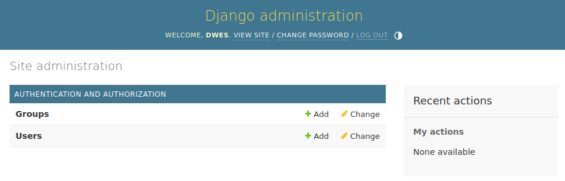
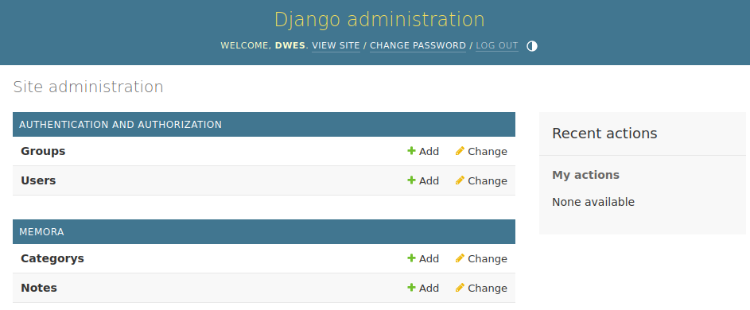

# Antes de empezar
Crea un entorno virtual, actívalo y ejecuta el comando `pip install -r requirements.txt` para instalar los requisitos, entre ellos **Django 5.0**.

A partir de aquí, todo el trabajo, comandos, etc, los tienes que hacer dentro del entorno virtual de Python.

# Comprueba la version de Django
Si quieres comprobar si está Django instalado y qué version tienes instalada, ejecuta el comando: `python -m django --version`.

# Crea un proyecto nuevo
Imagina que quieres crear un **proyecto llamado dwes**. Usa `django-admin` para crear el nuevo proyecto:

``` shell
$ django-admin startproject dwes
```

Este comando crea toda la estructura sobre la que construir el proyecto:

``` shell
dwes/
    manage.py
dwes/
        __init__.py
        settings.py
        urls.py
        asgi.py
        wsgi.py
```

# Enciende las luces y prueba tu proyecto
Para desarrollar y probar tu aplicación en el entorno de desarrollo no necesitas instalar **Gunicorn**, ni **Apache**, ni **Nginx**... nada: puedes usar el servidor de desarrollo del framework de Django.

Entra en la carpeta `dwes` si no lo estás ya y lanza el servidor:

``` shell
$ python manage.py runserver
```

Verás que arranca dicho servidor en el **puerto 8000** de tu máquina local.

Abre el navegador web, escribe en la URL **http://localhost:8000** y, ¡ahí lo tienes!, ¡tu primera aplicación Django!

> Este servidor es de desarrollo, en absoluto se usa en entornos de producción.

> Si quieres arrancar el servidor en otro puerto: `python manager.py runserver 0.0.0.0:8080`.

# Crea una aplicación nueva
Hasta aquí, lo que hemos hecho es crear un proyecto. Ahora te explico cómo crear una aplicación: sí, en un mismo proyecto de Django puedes crear varias aplicaciones. Los proyectos grandes suelen ser, como su propio nombre indica, grandes. Una forma de resolver la complejidad es dividir un proyecto en aplicaciones más manejables.

Vamos a crear una aplicación de notas y recordatorios, y la vamos a llamar **memora**.

``` shell
$ python manage.py startapp memora
```

> A estas alturas ya te estarás dando cuenta que el script de Python `manage.py` es especial en Django. Sí, es el script que nos va a permitir automatizar tareas en Django y, como ves, está en la raíz del proyecto.

Tras ejecutar el comando verás una nueva carpeta, llamada `memora`, con una jerarquía tal que así:

``` shell
memora/
    __init__.py
    admin.py
    apps.py
    migrations/
        __init__.py
    models.py
    tests.py
    views.py
```

Esta estructura hospeda la aplicación que acabamos de crear.

# Tu primera vista
Para crear un vista en Django necesitamos dos cosas:

1. Crear un función que reciba el **Request** y devuelva el **Response**.
2. Añadir una ruta para poder acceder a esa vista, de manera que tengas mapeado un URL con nuestra vista.

Las vistas se crean... sí... en el fichero `views.py` de la aplicación. Las rutas se definen en un fichero llamado `urls.py` que tendrás que crear. Ahora, la estructura de nuestra aplicación queda así:

``` shell
memora/
    __init__.py
    admin.py
    apps.py
    migrations/
        __init__.py
    models.py
    tests.py
	urls.py
    views.py
```

Esta va a ser nuestra vista (la más sencilla posible):

``` python
from django.http import HttpResponse


def index(request):
    return HttpResponse("Hola Mundo! Estás en Memora, la aplicación definitiva.")
```

Y aquí tienes el contenido del fichero `urls.py` con la ruta y la vista que se va a llamar cuando se acceda a dicha ruta:

``` python
from django.urls import path

from . import views

urlpatterns = [
    path("", views.index, name="index"),
]
```

Por último, tienes que modificar el fichero principal de URLs que está dentro del proyecto, en `dwes/urls.py`, para incluir las rutas de la aplicación memora:

``` python
from django.contrib import admin
from django.urls import path, include

urlpatterns = [
    path("memora/", include("memora.urls")),
    path('admin/', admin.site.urls),
]
```

Ahora, si arrancas el servidor, y accedes a la dirección `http://localhost:8000/memora` verás la vista que acabas de crear.

# Configuración: base de datos y más
Por defecto, Django viene preparado para usar como sistema gestor de base de datos **SQLite** y, de hecho, verás que hay un fichero en la raíz llamado `db.sqlite3`: esa va a ser nuestra base de datos.

La configuración la encuentras en `dwes/settings.py`. Se trata de un módulo normal de Python con variables a nivel de módulo que representan la configuración de Django.

Si buscas en este fichero la variable `DATABASE` verás esto:

``` python
DATABASES = {
    'default': {
        'ENGINE': 'django.db.backends.sqlite3',
        'NAME': BASE_DIR / 'db.sqlite3',
    }
}
```

Que marca SQLite como motor de base de datos que va a usar Django.

Otras opciones a destacar:

- Aplicaciones: son dependencias que añaden y facilitan tareas y acciones.
- Información de zona horaria.

## Migraciones
La gestión de la base de datos se hace por medio de lo que se denominan **migraciones**.

Cada vez que haces cambios que implican a la base de datos hay que preparar y lanzar migraciones.

De momento, vas a inicializar la base de datos ejecutando las migraciones iniciales:

``` python
$ python manage.py migrate
```

Verás que se han creado algunas tablas en la base de datos, necesarias para ciertas aplicaciones incluidas en la configuracion relacionadas con la autenticación, gestión de sesiones, etc.

## Manager para SQLite
Personalmente, suelo usar la aplicación **DB Browser for SQLite** que encontrarás [aquí](https://sqlitebrowser.org/). Es muy fácil de usar: solo tienes que abrir el fichero `db.sqlite3`.

> Sí, también está para Windows... y para MacOS... pero lo más importante es que es software libre y está para GNU/Linux.

# Modelos
Django nos permite interactuar con la base de datos por medio de modelos para insertar, eliminar, actualizar y obtener información de la base de datos usando una API llamada ORM (Object Relational Mapping). Los ORM son abstracciones de la base de datos que facilita todo lo relacionado con las operaciones sobre bases de datos.

Dentro de `dwes/memora` verás un fichero llamado `models.py` donde vas a definir nuestros modelos.

Antes, te muestro a continuación el Modelo Relacional de la base de datos que vamos a usar en nuestra aplicación **memora**:

``` text
categories(id, name)
    PK: id
	VNN: name
	
notes(id, note, pub_date, category_id)
	PK: id
	VNN: note, pub_date
	FK: category -> categories(id)
```

Conocida nuestro esquema de base de datos aquí tienes el contenido del fichero `models.py`:

``` python
from django.db import models


class Category(models.Model):
    name = models.CharField(max_length=20)


class Note(models.Model):
    note = models.TextField()
    pub_date = models.DateTimeField("date published")
    category = models.ForeignKey(Category, on_delete=models.CASCADE, on_update=models.CASCADE)

```

Habrás notado que no he creado ningún atributo llamado **id**. Todos los modelos de Django toman, automáticamente, un atributo llamado **id** con la característica de **auto_increment**.

Con estos modelos Django es capaz de:

- Crear el esquema de la base de datos (**create table**).
- Crear objetos de las clases `Category` y `Note` para el acceso a la base de datos.

# Añadir la aplicación al proyecto
Abre el fichero `dwes/settings.py` y añade al array `INSTALLED_APPS` la aplicación **memora** añadiendo la clase `MemoraConfig` que está en `memora/apps.py`:

``` python
INSTALLED_APPS = [
    'memora.apps.MemoraConfig',
    'django.contrib.admin',
    'django.contrib.auth',
    'django.contrib.contenttypes',
    'django.contrib.sessions',
    'django.contrib.messages',
    'django.contrib.staticfiles',
]
```

# Ejecutar migraciones de la aplicación
Hemos creado los modelos y, ahora, hay que ejecutar las migraciones para que Django actualice la base de datos. Se necesitan dos pasos:

El **primer paso** consiste en **crear la migración**:

``` shell
$ python manage.py makemigrations memora
```

Cada vez que hagas cambios en los modelos tendrás que ejecutar las migraciones como ves arriba indicando, además, la aplicación sobre la que hemos hecho cambios en los modelos. De esta manera sincroniza la base de datos con los modelos.

Si tras lanzar las migraciones todo ha ido bien, tendrás que ver este mensaje en la salida de la terminal:

``` shell
Migrations for 'memora':
  memora/migrations/0001_initial.py
    - Create model Category
    - Create model Note
```


Ahora ya puedes realizar el **segundo paso** consistente en **lanzar la migración**:

``` shell
$ python manage.py migrate
```

# Las migraciones desde dentro
Cada vez que creas una migración se crea un fichero con dicha migración en la carpeta `migrations/` de la aplicación. En nuestro caso, verás que hay un fichero llamado `memora/migrations/0001_initial.py` con la migración. El prefijo **0001** sirve de identificación de la migración y lo puedes usar, por ejemplo, para ver, con el siguiente comando, las sentencias SQL que se han ejecutado con dicha migración:

``` shell
$ python manage.py sqlmigrate memora 0001
```

Veás los **create table** que se han ejecutado para este caso:

``` shell
BEGIN;
--
-- Create model Category
--
CREATE TABLE "memora_category" ("id" integer NOT NULL PRIMARY KEY AUTOINCREMENT, "name" varchar(20) NOT NULL);
--
-- Create model Note
--
CREATE TABLE "memora_note" ("id" integer NOT NULL PRIMARY KEY AUTOINCREMENT, "note" text NOT NULL, "pub_date" datetime NOT NULL, "category_id" bigint NOT NULL REFERENCES "memora_category" ("id") DEFERRABLE INITIALLY DEFERRED);
CREATE INDEX "memora_note_category_id_9ecd0fd0" ON "memora_note" ("category_id");
COMMIT;
```

# La terminal de Django
Del mismo modo que podemos lanzar la terminal de Python (REPL) para probar cosas y "cacharrear", podemos hacer lo mismo con la terminal de Django. Para acceder a ella:

``` shell
$ python manage.py shell
```

Ahora podrías usar los modelos y usar el lenguaje del ORM de Django vía modelos para obtener información de la base de datos o insertar, borar y actualizar registros. Prueba lo siguiente:

``` shell
>>> from memora.models import Category, Note

# Estos es un "select * from notes"... y vemos que no hay nada en la tabla
>>> Note.objects.all()
<QuerySet []>

# Creamos una categoría (esto es un "insert into categories...")
>>> c = Category(name="instituto")
>>> c.save()
>>> c.id
1

# Creamos una nota usando dicha categoría (es un "inserto into notes...")
>>> from django.utils import timezone
>>> n = Note(category=c, note="Estudiar para DWES.", pub_date=timezone.now())
>>> n.save()
>>> n.id
1

# Podemos obtener la información a través del objeto Note
>>> n.note
"Estudiar para DWES."
>>> n.pub_date
datetime.datetime(2023, 12, 28, 10, 44, 57, 258060, tzinfo=datetime.timezone.utc)

# Podemos actualizar (equivale a un "update notes set...")
>>> n.note = "Estudiar para todos los módulos de DAW."
>>> n.save()

# ¡Qué facil ha sido actualizar un registro con ORM!
>>> n.note
"Estudiar para todos los módulos de DAW."

# Ahora, si hacemos un "select * from...", sí hay registros en la tabla notes
>>> Note.objects.all()
<QuerySet [<Note: Note object (1)>]>
```

Con esto te harás una idea de lo poderosa que es una herramienta o API como ORM. Más adelante profundizaremos en el ORM de Django.

# Django Admin
Copio y pego lo que recoge la web oficial de Django sobre la filosofía de esta aplicación **Django Admin**:

> Generating admin sites for your staff or clients to add, change, and delete content is tedious work that doesn’t require much creativity. For that reason, Django entirely automates creation of admin interfaces for models.

> Django was written in a newsroom environment, with a very clear separation between “content publishers” and the “public” site. Site managers use the system to add news stories, events, sports scores, etc., and that content is displayed on the public site. Django solves the problem of creating a unified interface for site administrators to edit content.

> The admin isn’t intended to be used by site visitors. It’s for site managers.

Para empezar a usar **Django Admin** tienes que crear un usuario administrador (*superuser*):

``` shell
$ python manage.py createsuperuser
```

> Vamos a usar el usuario **dwes** con contraseña **dwes** con *superuser*. El e-mail te lo puedes inventar o poner el que quieras.

Tras crear el *superuser* ya podrás acceder a `http://localhost:8000/admin/` y empezar a usar **Django Admin**. Pero, ¿dónde están nuestros modelos?, ¿los modelos de la aplicación **memora** que hemos creado?, ¿por qué no aparecen?



Para que aparezcan los modelos de la aplicación **memora** tienes que configurar **Django Admin** para que añada los modelos que quieras. Tienes que hacerlo a través del fichero `memora/admin.py`:

``` python
from django.contrib import admin


from .models import Category, Note

admin.site.register(Category)
admin.site.register(Note)

```

Ahora sí verás estos modelos:


